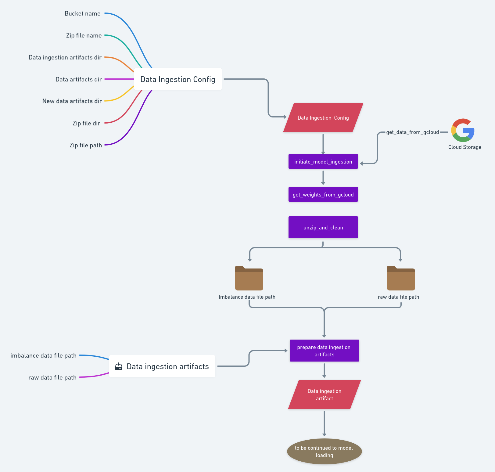
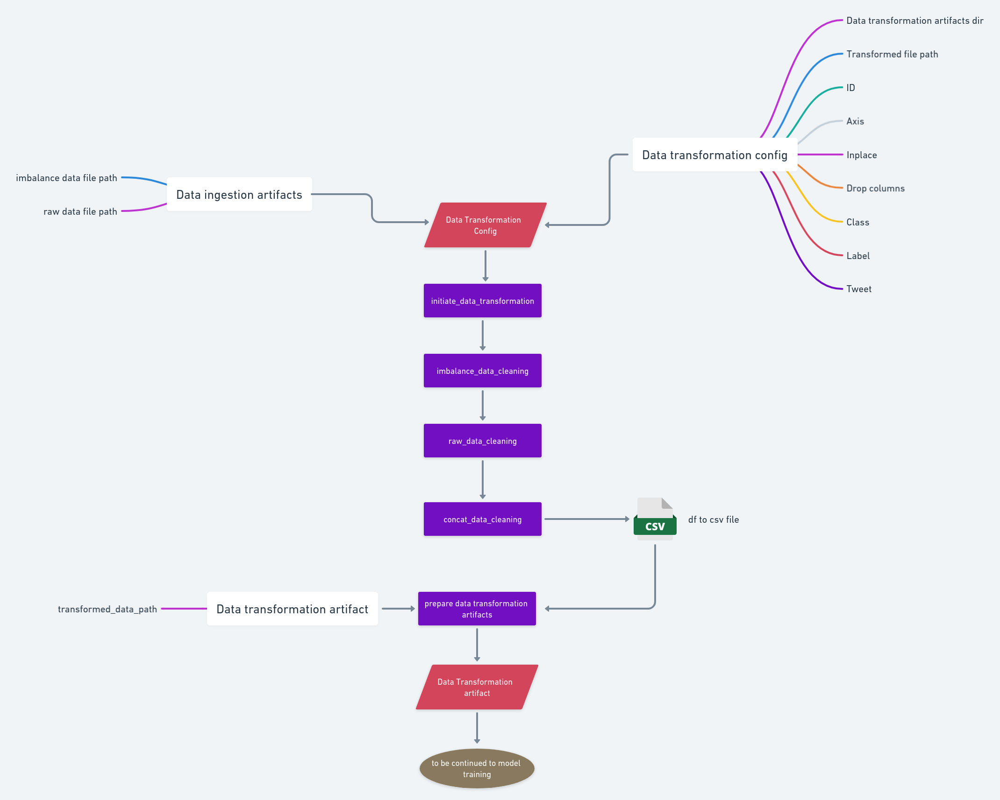
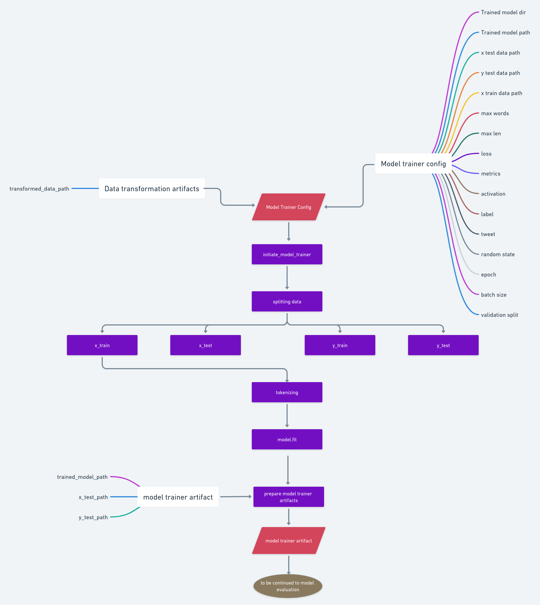
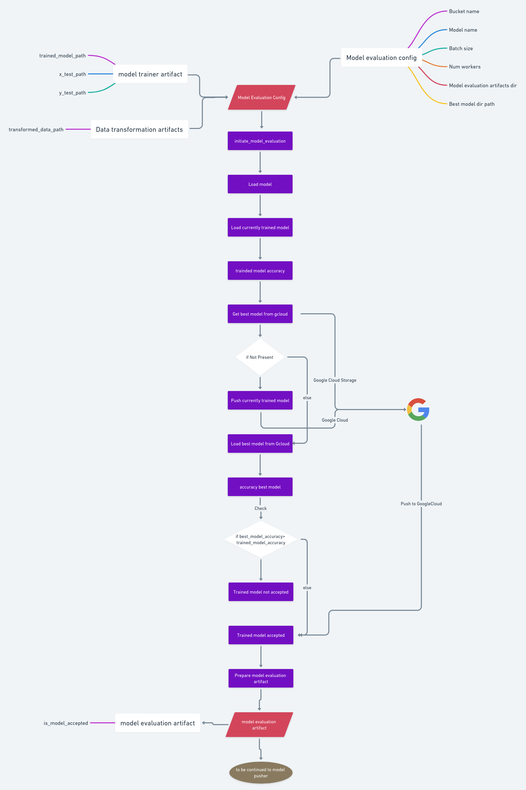
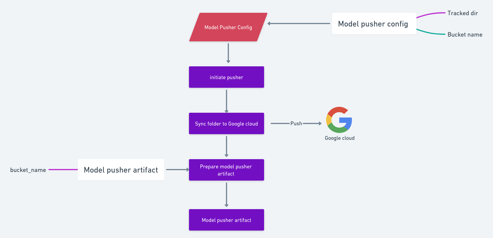

# Hate Speech Classification (FastAPI + TensorFlow)

<!-- Badges (update repo in URLs after pushing) -->


Hate speech and abusive language detector built with TensorFlow 2.x and served via FastAPI. It provides:

- Offline training pipeline with modular steps (ingestion → transformation → training → evaluation → push)
- Inference API to classify text as hate/abusive or not
- Google Cloud Storage integration for model artifacts
- Dockerfile for containerized deployments

## Features

- End-to-end ML pipeline in `hate.pipeline.train_pipeline.TrainPipeline`
- Prediction pipeline in `hate.pipeline.prediction_pipeline.PredictionPipeline`
- REST endpoints:
	- GET `/train` – run training pipeline
	- POST `/predict` – classify a text string
	- Auto docs at `/docs`

## Quickstart

1) Create env and install deps

```powershell
python -m venv .venv; .\.venv\Scripts\Activate.ps1; pip install -r requirements.txt
```

2) Run the API

```powershell
python app.py
```

Then open http://localhost:8080/docs to try endpoints.

## Docker

Build and run container:

```powershell
docker build -t hate-speech-api .
docker run -p 8080:8080 --name hate-speech-api hate-speech-api
```

## API

- POST `/predict`

Request body (form or JSON):

```json
{
	"text": "you are good"
}
```

Response:

```json
"hate and abusive" | "no hate"
```

## Configuration

Key constants live in `hate/constants/__init__.py`:

- `BUCKET_NAME` – GCS bucket for dataset and models
- `MODEL_NAME` – model filename, default `model.h5`
- App host/port, training hyperparameters, etc.

For GCS, install gcloud CLI and authenticate:

- https://dl.google.com/dl/cloudsdk/channels/rapid/GoogleCloudSDKInstaller.exe

Then ensure your service account or user has storage access to the bucket.

## Project layout

```
app.py                  # FastAPI app
hate/
	components/           # ingestion, transformation, trainer, evaluation, pusher
	pipeline/             # TrainPipeline and PredictionPipeline
	ml/                   # model architecture
	...
requirements.txt
Dockerfile
```

### Pipeline overview

<div>
	
	
</div>
<div>
	
	
</div>
<div>
	
</div>

## Development

Run training locally:

```powershell
python -c "from hate.pipeline.train_pipeline import TrainPipeline; TrainPipeline().run_pipeline()"
```

Run a quick prediction locally:

```powershell
python demo.py
```

## CI

This repo includes a basic GitHub Actions workflow to install dependencies and perform a lightweight lint/import check on pushes and PRs.

After pushing to GitHub, update the CI badge at the top of this README by replacing `USER/REPO` with your GitHub `owner/repository`.

## License

This project is licensed under the MIT License - see the [LICENSE](LICENSE) file for details.
